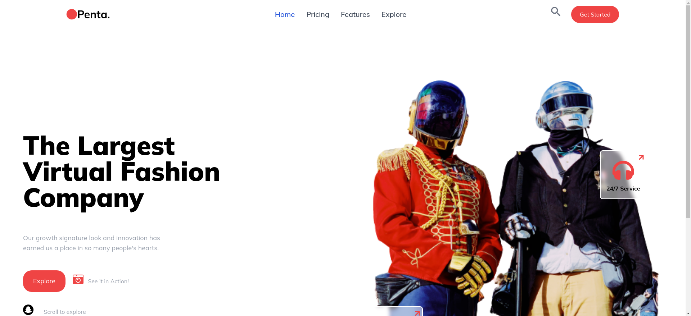
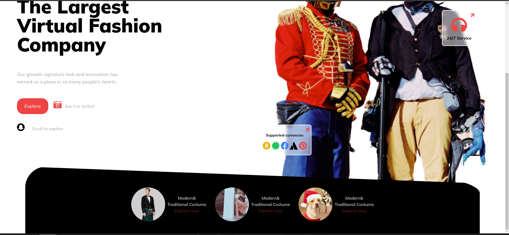

## Project Virtual-Fashion-Company

 - Bildchirmfotos von meinem Projekt

  .[Link von meiner Seite]( https://semihbeyzade.github.io/Virtual-Fashion-Company/)

 - In diesem Projekt wollte ich guten struktierten HTML-CSS- und TAILWIND-Code schreiben.

 - Ich habe meine Musterseite in Dribble.com gefunden.

 - Der Link der Seite, in dem ich mein Projekt gefunden habe.

   .[ Penta - Virtual Fashion Company ](https://dribbble.com/shots/16924520-Penta-Virtual-Fashion-Company?utm_source=Clipboard_Shot&utm_campaign=ssnabilla&utm_content=Penta%20-%20%20Virtual%20Fashion%20Company&utm_medium=Social_Share&utm_source=Clipboard_Shot&utm_campaign=ssnabilla&utm_content=Penta%20-%20%20Virtual%20Fashion%20Company&utm_medium=Social_Share)

 - Ich hatte die Gelegenheit, meinen ersten Tailwind-Code in der Responsive-Phase der Seite zu schreiben.

 - Ich kann "Browser-Präfix" als fehlenden Teil meines Projekts sagen. Ich habe das Projekt nur auf Google Chrome ausprobiert.

